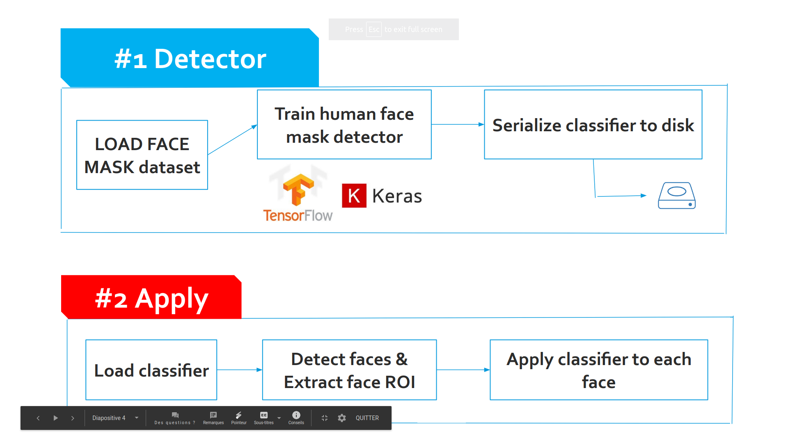
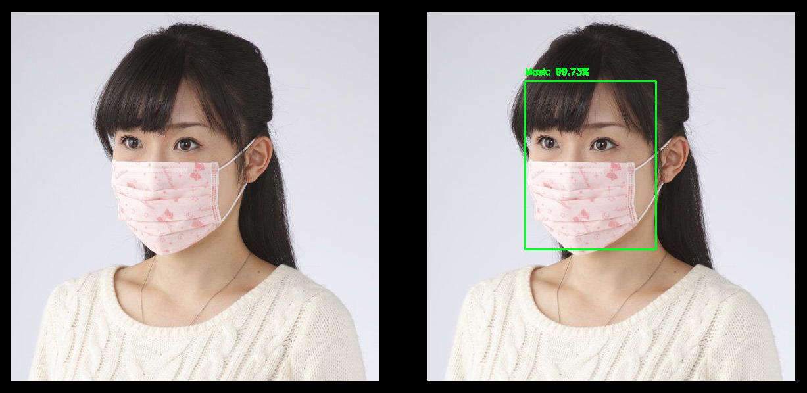
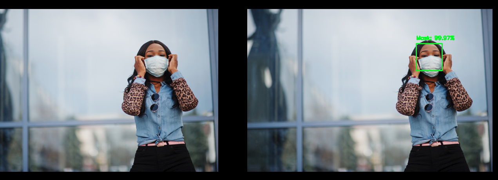
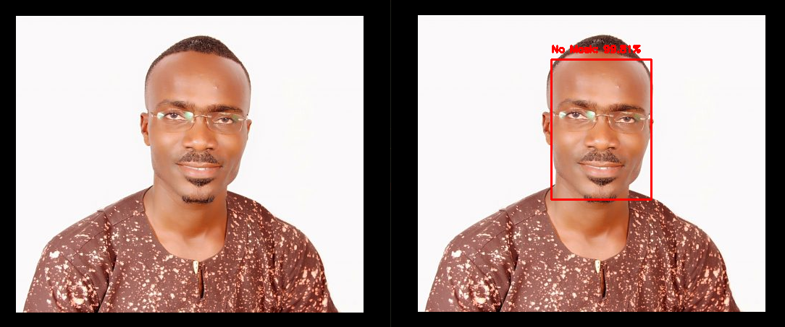
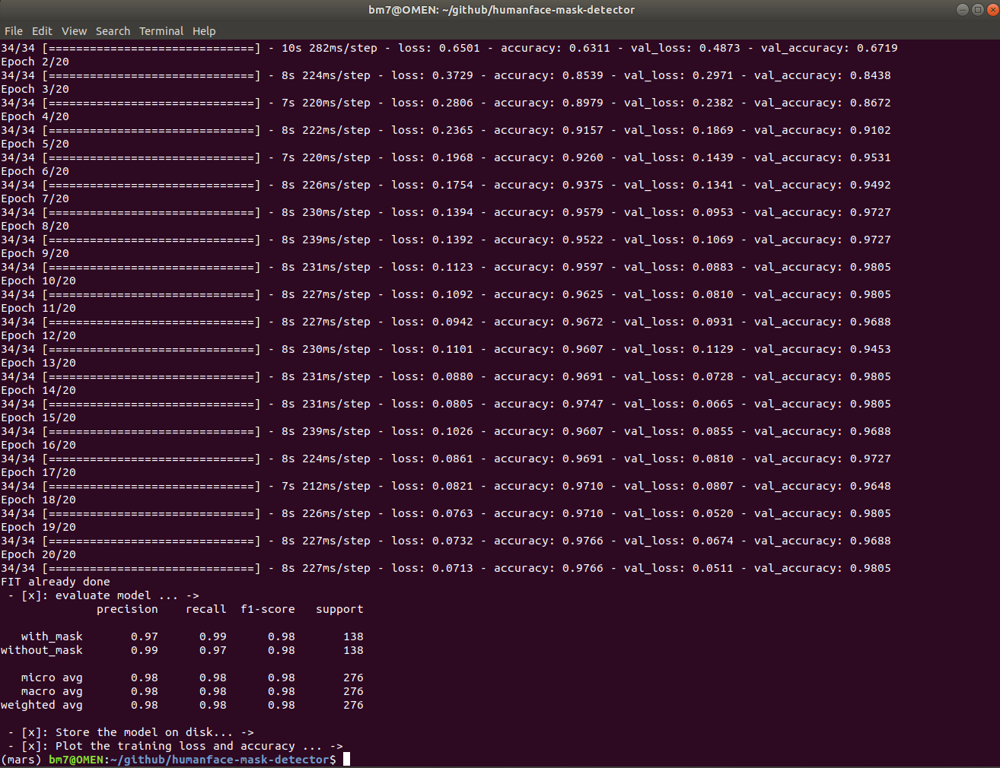
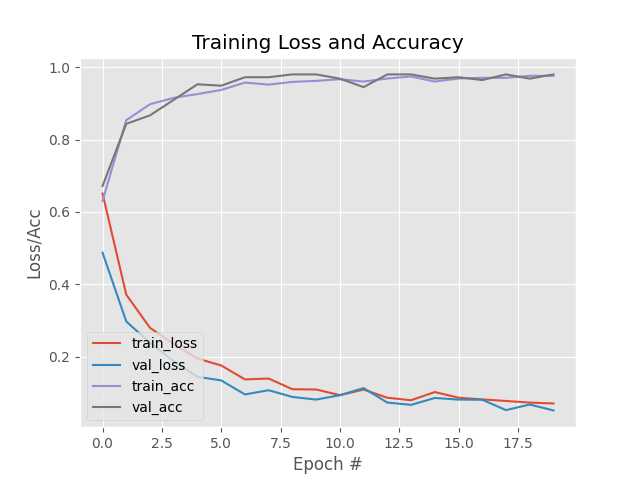

### How does human face mask detector work?
 - 

 - Result of human face detector
 



reference for images: ,  and 
- 
 - 
 - 

### Install dependencies
 - [x] tensorflow
 - [x] numpy      
 - [x] sklearn  (scikit-learn) 
 - [x] tensorflow-gpu
 - [x] matplotlib
 - [x] imutils

### Clone the project
```
$git clone https://github.com/bm777/humanface-mask-detector.git
cd humanface-mask-detector
```

### How to implement your own face mask detector

 - Fine tuning
 Load model: res10_300x300_ssd_iter_140000.caffemodel.
 We Construct  new FC head(Fully connected layers), append it the base model and we freeze the base layers of the network(res10.*.caffemodel)
 -Notice: the weight sof the layers(base model) will not uploaded during the process of backpropagation. Whereas the head layer weight will be tunued. 
 - Training, testing and validation stage
 In this section, we load face mask dataset from disk and then train a model using tensorflow.keras 2.1.0.
 To perform your accuracy, you can change your hyperparameters(batch size and number of epoch learning rate)
 ```
 python3 fm_train.py --dataset dataset
 ```

 - History ploted



### Credit
 - the dataset was created by : [Prajna Bhandary](https://lnkd.in/fJTAP_D)
 - part of code from [Adrian Rosebrock](https://www.pyimagesearch.com/2020/05/04/covid-19-face-mask-detector-with-opencv-keras-tensorflow-and-deep-learning/)
 - part of fine tuning from this : [LINK](https://www.pyimagesearch.com/2019/06/03/fine-tuning-with-keras-and-deep-learning/)
 - part of face Landmark to augment database: ALready done by Adrian Rosebrock
 - pretrained model used: MobileNetV2 -> [ImageNet weights](http://www.image-net.org/)